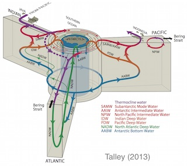
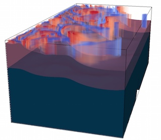
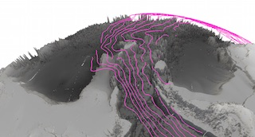
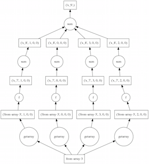

Research
========

Ocean Circulation and Mixing
----------------------------

An intricate network of currents circulates water through the global
ocean. This circulation is important for Earth’s climate because it
transports heat, salt, and dissolved chemicals (such as carbon and
oxygen) from the surface, where they are in contact with the atmosphere,
to the deep abyss, where they can be isolated and stored for centuries
or more. One of our main goals is to understand what controls the
strength and structure of this global circulation.

Mesoscale Dynamics
------------------

On scales of 10-500 km, the ocean is a twisted tangle of eddies,
filaments, and fronts. The behavior of these turbulent flows is
dynamically similar to weather systems of the atmosphere. The complexity
of the ocean mesoscale is a central focus of our research. We are trying
to understand how energy flows through the mesoscale, the rates at which
mesoscale eddies mix the ocean, and how mesoscale transport processes
influence climate and ocean biology. Better understanding of the
mesoscale transport processes will lead to better representation of
sub-grid mixing in climate models.

Southern Ocean and Climate
--------------------------

   ACC

The Southern Ocean surrounds Antarctica and connects the other three
major ocean basins (Atlantic, Pacific, and Indian). It is the home to
the world’s strongest current, the Antarctic Circumpolar Current, and is
full of mesoscale eddies. Because so much water comes together here, the
Southern Ocean is central to the global circulation, but the intense
mesoscale turbulence (and a historical lack of observations), make it
very challenging to understand the flow. Improved understanding of the
drivers of Southern Ocean circulation will help improve future climate
predictions and will also shed light on past climates, such as glacial
cycles.

Big Data Analysis
-----------------

Scientific datasets are growing in size at an exponential rate, and
oceanographic data is no exception. New high-resolution satellite
observations and autonomous observing platforms are producing data
faster than we can analyze it. Global eddy-resolving ocean models in
particular can easily generate terabytes and petabytes of data. Our
usual data analysis tools break down when confronted with these data
volumes. We am actively engaged in developing open-source software tools
to overcome this barrier and enable our community to efficiently process
oceanographic Big Data.
